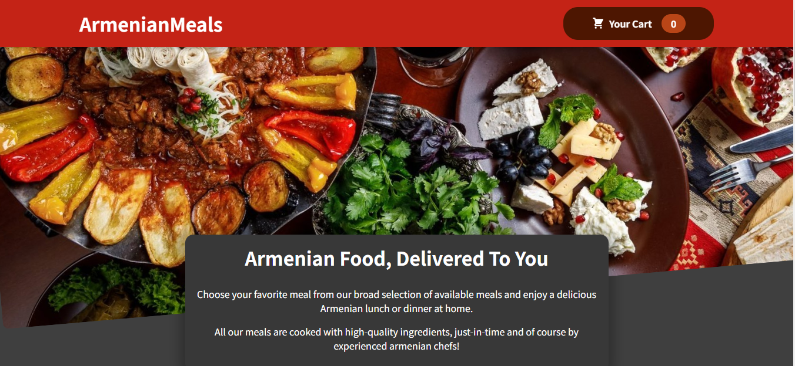
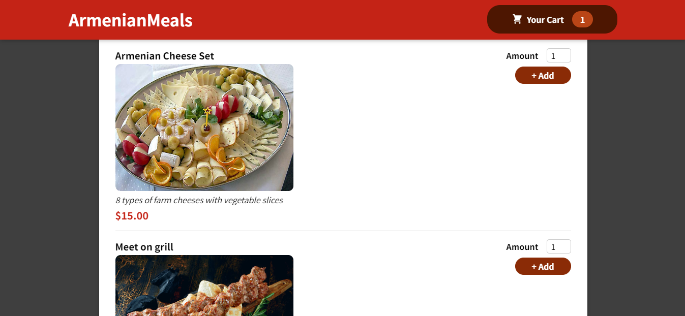
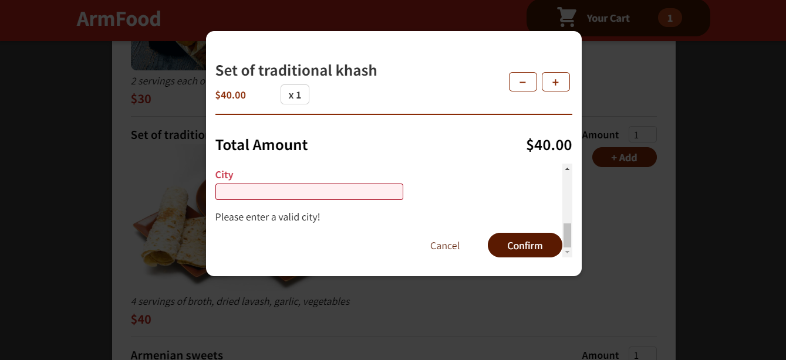
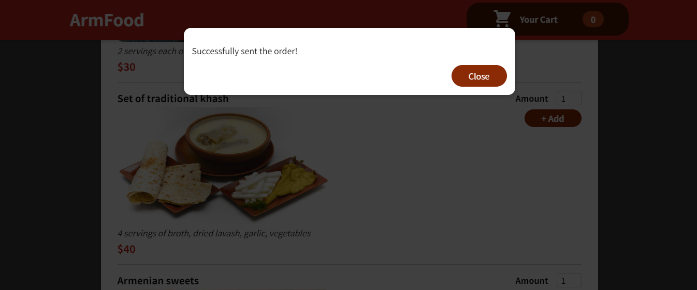

<h2>Интернет-магазин армянской еды на React</h2>

Добро пожаловать в интернет-магазин армянской еды на React! Это приложение позволяет покупать армянские блюда онлайн и получать их доставку в удобное для вас время.

<h3>Как пользоваться приложением</h3>
После запуска приложения вы попадете на главную страницу, где вы сможете просмотреть список доступных блюд. Вы можете использовать фильтры, чтобы уточнить поиск. После выбора блюда, добавьте его в корзину, указав количество и нажав на кнопку "Добавить в корзину". Вы можете просмотреть свою корзину, нажав на соответствующую кнопку в правом верхнем углу страницы.

<h3>Есть форма заказа с валидацией</h3>

<h3>Когда заказ оформлен, появится окно подтверждения</h3>

